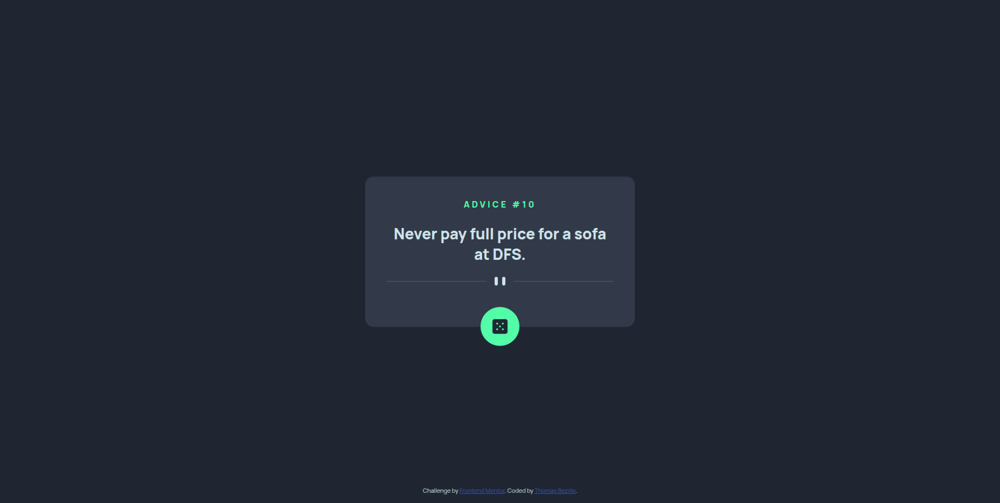
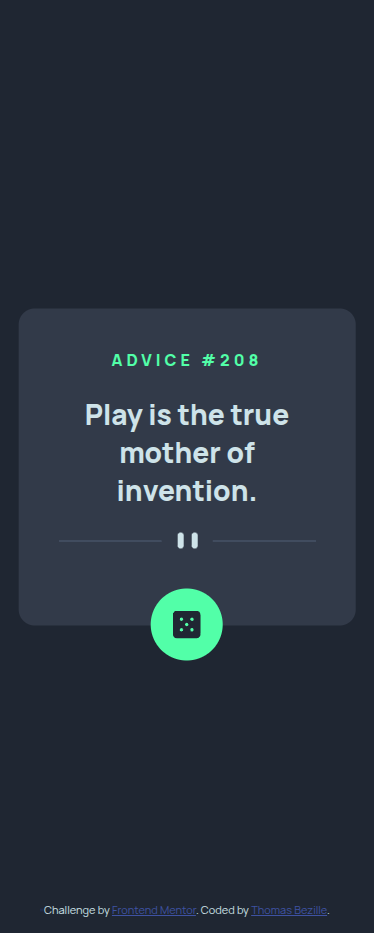

# FrontEnd-Mentor: Advice Genaratoe App

> Advice Genaratoe App - Challenge Frontend Mentor. Composant de génération de conseils aléatoires réalisé avec HTML5 CSS3 et JS.

**🔗 [Demo en ligne]()**

---

## 🎯 Objectif

Cette exercice permet de consolider les bases de HTML, CSS et JavaScript en utilisant des appels auprès d'une API (https://api.adviceslip.com/)

**Ce que j'ai appris :**

- Les layouts adaptatif avec Flexbox
- L'approche mobile-first
- La dynamisation avec JavaScript
- Les appels API
- La gestion des cas d'erreurs

---

## 🛠️ Stack

---

## 👤 Contact

**Thomas Bezille** — Développeur web à Nantes

